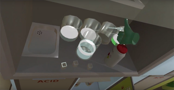

# Lab Safety Simulator: Chlorophyll Extraction

A VR-based safety simulator for chlorophyll extraction, an undergraduate biology lab exercise.

[Download Link](https://squaresquire286.itch.io/chlorophyll-extraction)

---

## Overview

Lab Safety Simulator: Chlorophyll Extraction is a room-scale virtual reality training simulation designed to teach and assess safe laboratory procedures during a chlorophyll extraction experiment.

The simulation combines interactive VR mechanics with safety training objectives. Users must follow proper laboratory procedures, consult safety documentation, use appropriate personal protective equipment (PPE), handle chemicals safely, and complete the chlorophyll extraction process using standard lab equipment.

The experience includes both procedural tasks and consequence-based learning. Unsafe behaviour can trigger incidents such as chemical spills or fires, which the user must resolve before continuing the exercise.

This project was developed under contract for the Faculty of Science at the University of Regina as part of an initiative exploring virtual reality for laboratory safety training.

---

## Team & Contributions

**Jacob Sauer**: Backend development

**Wil J. Norton**: Frontend development, modelling

**Vincent Ignatiuk**: Conception, external supervision

**Geremy Lague**: Playtesting, coordination

**David Gerhard**: Playtesting, coordination, internal supervision

---

## Interaction System

The simulation uses a color-coded interaction system to distinguish between two types of interactions:

- **Yellow Highlight** — Physical interaction (objects can be picked up and moved)
  - Glassware
  - Clipboards
  - Chemical containers
  - Drawers
  - Tools

- **Cyan Highlight** — State interaction (object state can be changed but not moved)
  - Computer buttons
  - Faucet handles
  - Eyewash station
  - Fume hood controls

This interaction model was designed to make object affordances immediately understandable in VR without requiring complex control schemes.

---

## Objective-Based Logic

The simulation uses a 100% scoring system divided into two categories:

- **Safety Procedures (50%)**
  - Reviewing safety documentation
  - Wearing PPE
  - Using equipment correctly
  - Following proper lab protocols

- **Chlorophyll Extraction Task (50%)**
  - Preparing samples
  - Washing with acetone
  - Transferring to cuvette
  - Analyzing sample using spectrophotometer

Users can lose points by triggering incidents such as fires, spills, or breaking glassware. Points lost due to incidents can be recovered by correctly resolving the incident and completing an incident report. Points lost due to improper handling of glassware **cannot** be recovered.

At any point in the simulation, users can consult a **binder** for guidance on proper safety protocols.

---

## Legal Notice

This project was developed under contract for the Faculty of Science at the University of Regina. The University of Regina retains intellectual property rights to the full application and source code.

This repository is presented as a portfolio case study only and does not contain the original project source code. All screenshots, descriptions, and documentation are used for the purpose of demonstrating system design, interaction design, and VR development experience.
